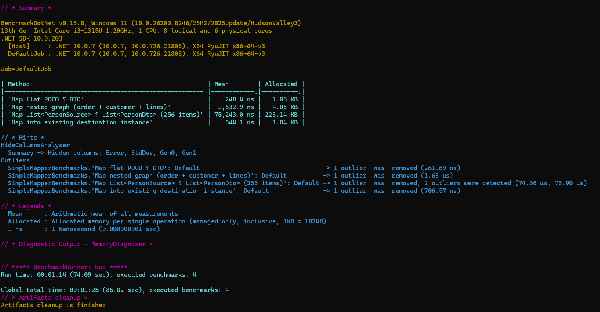

# ObjectMap.NET

A lightweight and high-performance object mapper for .NET! [ObjectMap.NET](https://www.nuget.org/packages/ObjectMap.NET/)

**ObjectMap.NET** (`PackageId`: `ObjectMap.NET`) is a compact convention-based object mapper for modern .NET. The implementation lives in the `SimpleMapper` namespaces. It is designed for **explicit maps** (no surprise magic between unrelated types) with optional **per-member** configuration.

**Target framework:** `net10.0`  
**Dependency (for DI):** `Microsoft.Extensions.DependencyInjection.Abstractions`

---

## Installation

**NuGet (when published):**

```bash
dotnet add package ObjectMap.NET
```

**Project reference (local development):**

```xml
<ProjectReference Include="path\to\SR.ObjectMapper.NET.csproj" />
```

---

## Quick start

### 1. Register the mapper and a profile

```csharp
using SimpleMapper.Mapper.Abstractions;
using SimpleMapper.Mapper.Configuration;
using SimpleMapper.Mapper.DependencyInjection;
using SimpleMapper.Mapper.Profiles;

// Program.cs or Startup
services.AddSRSimpleMapper(cfg =>
{
    cfg.RegisterProfile(new MyAppMappingProfile());
});
```

### 2. Define a profile

Inherit from `Profile`, override `ConfigureMaps()`, and call `CreateMap<TSource, TDestination>()` for every pair you map.

```csharp
using SimpleMapper.Mapper.Profiles;

public class MyAppMappingProfile : Profile
{
    protected override void ConfigureMaps()
    {
        CreateMap<OrderDto, OrderEntity>();
        CreateMap<LineItemDto, LineItemEntity>();
    }
}
```

### 3. Inject and map

```csharp
public class OrderService
{
    private readonly ISRSimpleMapper _mapper;

    public OrderService(ISRSimpleMapper mapper) => _mapper = mapper;

    public OrderEntity ToEntity(OrderDto dto) =>
        _mapper.Map<OrderDto, OrderEntity>(dto);
}
```

---

## Core API (`ISRSimpleMapper`)

| Method | Purpose |
|--------|--------|
| `TDestination Map<TDestination>(object source)` | Map when the **runtime** type of `source` is the registered source type (or a derived type in some cases). Resolves the map from `source.GetType()` to `TDestination`. |
| `TDestination Map<TSource, TDestination>(TSource source)` | Map using **static** `TSource` and `TDestination`. Preferred when the source type is known at compile time. |
| `TDestination Map<TSource, TDestination>(TSource source, TDestination destination)` | Map **into** an **existing** instance (update / patch pattern). |
| `IQueryable<TDestination> ProjectTo<TSource, TDestination>(IQueryable<TSource> source)` | `IQueryable` projection via `Select(x => Map<TSource, TDestination>(x))` (in-memory per row when the query runs). |

**Nulls:** `Map<TSource, TDestination>(TSource source)` returns `default` when `source` is null. The untyped `Map<TDestination>(object source)` throws if `source` is null.

---

## Configuration model

### `MapperConfiguration`

- **`RegisterProfile(Profile profile)`** — Builds all maps declared in the profile and registers them.
- **`GetMap(Type source, Type dest)`** — Used internally; throws `InvalidOperationException` if no map exists for that pair.

Every `(source type → destination type)` you use must be registered with **`CreateMap`** (or **`ReverseMap`**, which registers the inverse).

### `Profile`

Override **`ConfigureMaps()`** and call **`CreateMap<TSource, TDestination>()`** for each mapping. The fluent return type is **`TypeMapExpression<TSource, TDestination>`**.

---

## Fluent mapping API

### `CreateMap<TSource, TDestination>()`

Registers a one-way map. The mapper matches properties **by name** where types are compatible or where nested/collection rules apply (see below).

### `ReverseMap()`

Registers the inverse map **`CreateMap<TDestination, TSource>()`** on the same profile.

- **`Ignore()`** on the forward map is mirrored on the reverse map for the **same destination property name** (symmetric scenarios).
- **`ForMember` ... `MapFrom`** entries are translated where possible; reverse mappings copy configured members onto the reverse `TypeMap` when expressions can be reversed.

Call **`ReverseMap()`** when you need both directions:

```csharp
CreateMap<UserDto, UserEntity>().ReverseMap();
```

### `ForMember(dest => dest.Property, opt => { ... })`

| Call | Effect |
|------|--------|
| **`opt.Ignore()`** | Do not map this destination member from convention or nested/collection mapping. |
| **`opt.MapFrom(src => ...)`** | Set the destination member from a **custom expression** at runtime (after the compiled constructor mapping). |

Custom **`MapFrom`** is evaluated when applying **`ForMember`** configuration **after** the initial object is created. Navigation nulls are handled defensively where applicable.

---

## How mapping works (internals overview)

1. **Compiled path:** Simple scalar/navigation properties that are **assignable** can be bound into a **`MemberInit`** expression for speed.
2. **Skipped in compile:** Members with **`ForMember`** lambdas, ignored members, **collections**, and some mismatched types are handled at **runtime**.
3. **Runtime:** **`ApplyCustomMemberMappings`** applies **`MapFrom`** / configured lambdas. **`MapNestedProperties`** maps **nested objects** and **collections** using registered maps for **element** or **nested** types.

---

## Collections (`IEnumerable` / `ICollection` / `List` / arrays)

- Collections are **never** copied by reference when **element types differ**. The mapper enumerates the source and builds a **`List<TDestinationElement>`** (or array when mapping to an array type), mapping each element with **`CreateMap<TSourceElement, TDestinationElement>`**.
- You must register **`CreateMap<TSourceElement, TDestinationElement>`** for the element types.

**Example:**

```csharp
CreateMap<OrderDto, OrderEntity>();
CreateMap<LineItemDto, LineItemEntity>();
// OrderDto.Lines (List<LineItemDto>) -> OrderEntity.Lines (ICollection<LineItemEntity>)
```

**Same element type** (e.g. `List<int>` → `List<int>`) can be assigned when the types are compatible; the mapper still uses collection handling where needed.

**Strings** are not treated as collections.

---

## Mapping into an existing object

```csharp
_mapper.Map(sourceDto, existingEntity);
```

Behavior:

- **Non-collection** properties: copied by name when not ignored and not overridden by **`ForMember`**.
- **Collection** and **complex** properties: follow the same **`TypeMap`** as “map to new”: **ignored** and **explicit `MapFrom`** members are **not** overwritten by nested/collection mapping.
- **Always** register **`CreateMap<TSource, TDestination>`** for this pair; unmapped members are left unchanged if there is no source property or the member is ignored.

Use this for **EF** updates: load the entity, then map the DTO onto it. If you **manually** insert child rows in a service, you can **`.ForMember(d => d.Children, o => o.Ignore())`** on the `Dto → Entity` map so the mapper does not populate that navigation collection.

---

## `ProjectTo<TSource, TDestination>`

```csharp
var projected = _mapper.ProjectTo<OrderDto, OrderEntity>(dbContext.Orders.AsQueryable());
```

Implementation uses **`Queryable.Select`** with **`Map<TSource, TDestination>(x)`** per element. This is **not** LINQ translation to SQL; EF Core will only translate what fits in the expression tree you project. For heavy relational projections, prefer **`Select`** written manually or projection tailored for EF.

---

## Circular references

Nested mapping tracks **`visitedObjects`** by reference to reduce infinite recursion. Extremely tight graphs may still need **`Ignore()`** on specific navigation properties.

---

## Entity Framework notes

- **Proxies:** Nested mapping resolves **`Castle.DynamicProxy`** proxies by mapping from the **declared** property type when possible; proxies may be normalized to base entity types for **`GetMap`**.
- **Tracked entities:** Prefer **`Map(dto, entity)`** for updates instead of creating a new entity and attaching.

---


## Why use this over AutoMapper?

Use **ObjectMap.NET** when you want a **small, predictable mapper** for typical CRUD-style DTO ↔ entity transformations.

- **Lightweight & minimal API**: `CreateMap`, `ReverseMap`, `ForMember`, and `Map` cover most common cases.
- **Explicit mapping pairs**: encourages registering only the maps you use; fewer surprises from “magic” conventions.
- **Compiled mapping + caching**: good performance for repeated mappings in services.
- **Practical defaults for common mismatches**: supports common scalar differences (for example **string ↔ Guid**, **enum ↔ integral**, **string ↔ int**, **decimal → double**) and element-wise collection mapping when element maps exist.
- **Map into existing entities**: `Map(dto, entity)` works for update flows; collection/nested mapping respects `Ignore()` and explicit `ForMember` configuration.

When you should prefer **AutoMapper**:

- You need **true LINQ-to-SQL projection** (`ProjectTo` that EF can translate).
- You rely on advanced features like rich conventions, flattening/unflattening, resolvers, conditions, `AfterMap/BeforeMap`, etc.

---

## Performance Benchmarks

The following benchmarks were executed on .NET 10.0 using BenchmarkDotNet:

| Method | Mean (Time) | Allocated (Memory) |
| :--- | :--- | :--- |
| **Map flat POCO to DTO** | **248.4 ns** | **1.05 KB** |
| **Map nested graph** | **1,532.9 ns** | **4.05 KB** |
| **Map List (256 items)** | **75,243.0 ns** | **228.14 KB** |
| **Map into existing instance** | **644.1 ns** | **1.84 KB** |



---

## Limitations

- **Explicit map registration required**: you must call `CreateMap<TSource, TDestination>()` for each pair you map. There is no assembly scanning / auto-discovery.
- **Name-based mapping only**: automatic mapping matches properties by the **same name**. No flattening/unflattening, no naming conventions (snake_case ↔ PascalCase), no member renames unless you use `ForMember`.
- **Limited scalar conversions**: only a small set of scalar coercions are built-in (for example **string ↔ Guid**, **enum ↔ integral**, **string ↔ int**, **bool → string**, **decimal → double**). Anything else requires a `ForMember(... MapFrom ...)`.
- **Collections are replaced, not merged**: when mapping a collection property, the mapper creates a new `List<TDestElement>` and assigns it to the destination property. It does not diff/merge by key (common EF “update children” scenario).
- **`ProjectTo` is not SQL projection**: `ProjectTo` is implemented as `Select(x => mapper.Map<...>(x))`. EF Core will not translate the mapper’s compiled delegate to SQL; for real SQL projection prefer manual `Select`.
- **Only writable public properties**: mapping targets public settable properties. Fields and non-settable members are ignored.
- **Runtime failures may be hard to see**: some nested/collection mapping paths are defensive and may write to `Debug` instead of throwing; ensure you have logging/telemetry around mapping when debugging production issues.

---

## Requirements checklist

1. Register **`CreateMap<Source, Dest>`** for every pair you call **`Map`** with.
2. For collection properties with **different element types**, register **element** maps (e.g. `DtoLine` → `EntityLine`).
3. Use **`Ignore()`** when the destination property must not be touched by convention or nested mapping (password hashes owned elsewhere, navigation maintained manually, etc.).
4. Use **`MapFrom`** when the destination value comes from a computed path or a differently named source concept.

---

## Troubleshooting

| Symptom | Likely cause |
|---------|----------------|
| `No map found from X to Y` | Missing **`CreateMap<X, Y>`** (check exact CLR types, including generics). |
| Invalid cast / cannot convert `List<A>` to `ICollection<B>` | Old behavior: mapping into an existing object without element mapping. Current package maps collections by element or honors **`Ignore`**. Ensure element map exists, or **ignore** the collection if you set it in code. |
| Custom **`MapFrom`** not applied | Member not on **`TypeMap`**, or property not writable. |
| Collection always empty | No **`CreateMap` for element types**, or all items skipped (e.g. nulls / visit rules). |

---

## License

**MIT** (see package metadata).

---

## Author

**Shohanur Rahman**  
[LinkedIn](https://www.linkedin.com/in/shohanur-rahman-cse/)
